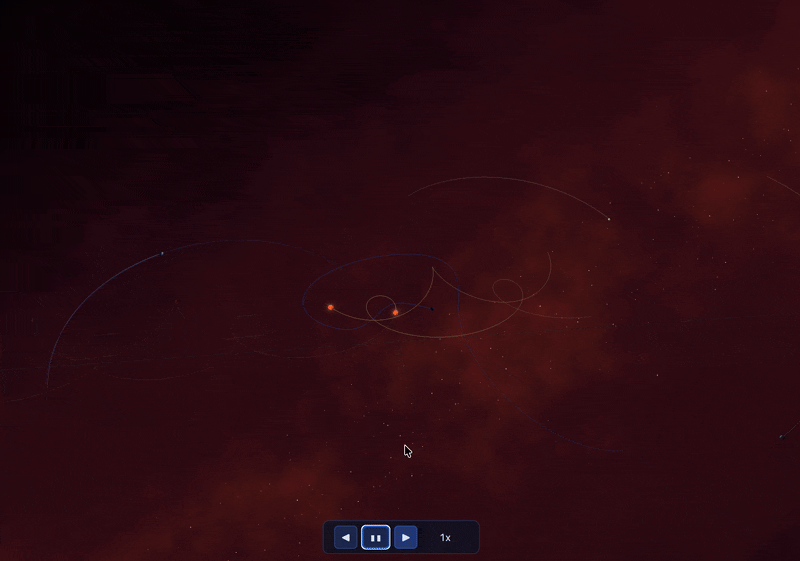

# HelioSim

A real-time, WebAssembly-powered N-body gravitational system simulator built with C++, OpenGL ES 3.0, GLFW, and Emscripten running directly in your browser. Its features include predicitve orbit trails, collision, time controls and body spawning.

[Live demo](https://koprolin.com/heliosim/)



## Controls
| Action                       | Description                   |
| :--------------------------- | :---------------------------- |
| **Left Drag**                | Orbit camera                  |
| **Scroll/Pinch**             | Zoom in/out                   |
| **Shift/Two-Finger Drag**    | Pan camera target             |
| **Resize window**            | Viewport adjusts dynamically  |

## Build Instructions

### Requirements

- [Emscripten SDK](https://emscripten.org/docs/getting_started/downloads.html)
- `make`
- `glm` header library (expected in `external/glm`)

### Build & Run

```bash
make
```
This will compile main.cpp to WebAssembly via emcc and launch your default browser automatically.

To enable the touch emulator (for testing touch input with a mouse on desktop):
```bash
make TOUCH_EMULATOR=1
```

To clean:
```bash
make clean
```

## Third-Party Libraries

| Library | License | Usage |
| :------ | :------ | :---- |
| [GLM](https://github.com/g-truc/glm) | MIT | Math library for OpenGL |
| [TouchEmulator](https://hammerjs.github.io/touch-emulator/) (Hammer.js) | MIT | Desktop touch event emulation for development |