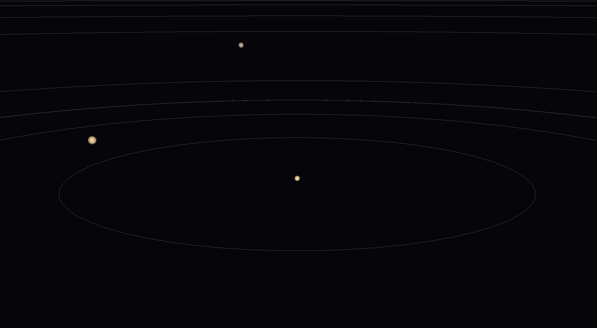

# HelioSim

A real-time, WebAssembly-powered N-body gravitational system simulator built with C++, OpenGL ES 3.0, GLFW, and Emscripten running directly in your browser. Still work in progress.

[Live demo](https://koprolin.com/heliosim/)



## Controls
| Action            | Description                  |
| :---------------- | :--------------------------- |
| **Left Drag**     | Orbit camera                 |
| **Scroll**        | Zoom in/out                  |
| **Resize window** | Viewport adjusts dynamically |

## Build Instructions

### Requirements

- [Emscripten SDK](https://emscripten.org/docs/getting_started/downloads.html)
- `make`
- `glm` header library (expected in `external/glm`)

### Build & Run

```bash
make
```
This will compile main.cpp to WebAssembly via emcc and launch your default browser automatically.
To clean:
```bash
make clean
```